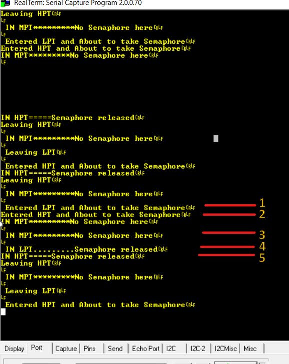

# PriorityInversion_FreeRTOS

This is the example which demonstrates ***Priority Inversion***:

----

Sequence is as follows:

- At '1' the Low Priority Task starts and acquire semaphore.
- At '2' the High Priority Task preempts and tries to acquire semaphore but fails, so goes into blocked state.
- At '3' the Medium Priority Task preempts Low Priority and will be in Running state for quite a long time.
- Now '4' MPT finishes its task and LPT starts running as there is no other task in Ready queue.
- At '5' LPT finishes and HPT then acquire semaphore and starts running. 
- **This indicates that most critical task in the system is running after Medium and Low Priority task consecutively**.

----

